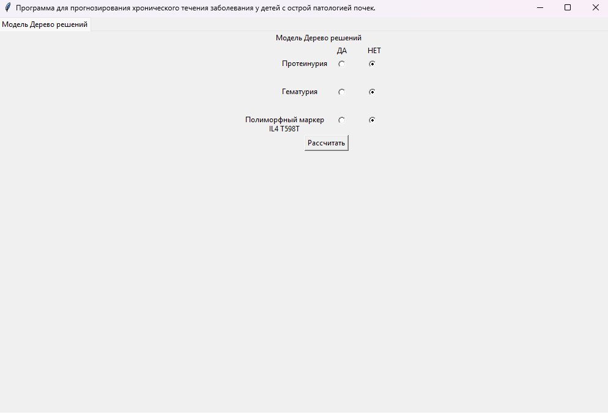
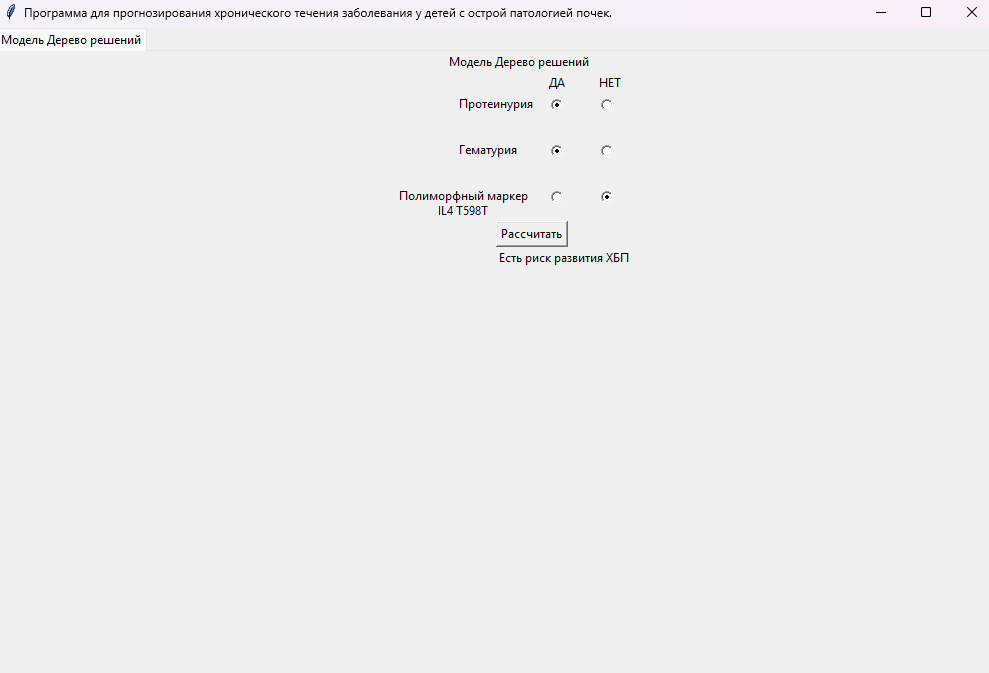
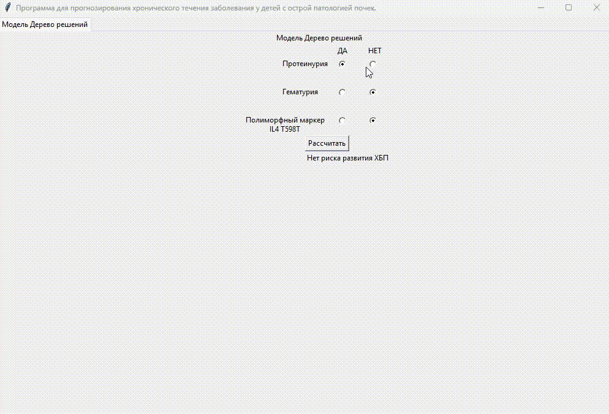

📘 Программа для прогнозирования хронического течения заболевания у детей с острой патологией почек (Свидетельство о государственной регистрации программы для ЭВМ № № 2024685630)

Интерактивный инструмент для врачей-нефрологов, основанный на простой диагностической модели «Дерево решений».
Приложение помогает определить риск развития хронической болезни почек (ХБП) у ребёнка на основе трёх клинических параметров.

⚠ Код логики и методология расчётов основаны на собственных экспертных правилах и медицинских материалах, поэтому полная версия алгоритма не публикуется.
В репозитории доступна демонстрационная версия интерфейса и EXE-сборка для портфолио.

🚀 Возможности

- Оценка риска развития ХБП на основе трёх параметров:

- протеинурия,

- гематурия,

- генетический маркер IL4 T598T.

- Полностью интерактивный интерфейс (Tkinter).

- Автоматический расчёт результата по алгоритму дерева решений.

- Лёгкая и быстрая демонстрация работы (доступен .exe-файл).

🧠 Логика модели

Программа использует набор экспертных правил, которые оценивают комбинации признаков:

В ряде сочетаний отмечается высокий риск,

В остальных случаях — риск отсутствует.

Алгоритм реализован в упрощённом виде для демонстрации и обучения.

📸 Скриншоты интерфейса
| Интерфейс |
|----------|
|  |

| Пример результата с положительным результатом|
|-------------------|
|  |

| Пример результата с отрицательным результатом|
|-------------------|
|  |
---
	
🎥 Демо-анимация работы программы

(Гифка, если добавишь её в репозиторий → например demo/demo.gif)

📦 Скачать сборку

Готовый EXE-файл доступен в разделе:

[👉 Releases](../../releases)

🔧 Технологии

- Python

- Tkinter

- Decision Tree Logic (custom)

ℹ Почему код частично закрыт?

Алгоритм основан на внутренних методических материалах и экспертных правилах, которые не подлежат открытой публикации.
Поэтому в репозитории размещена безопасная демонстрационная версия.

Включены:

- интерфейс программы,

- демонстрационная логика,

- визуальные материалы,

- готовая сборка EXE.

🧑‍💻 Автор

Кокин Александр — Python Developer
Telegram: @Yaporii
Email: Kokin.Alexander1@yandex.ru